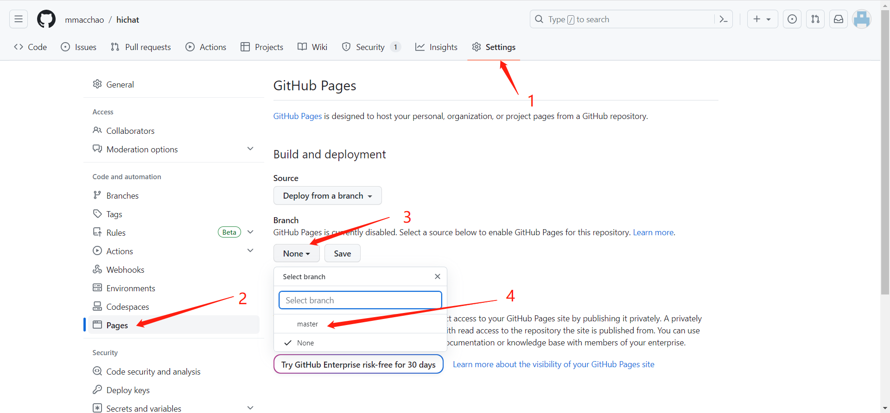
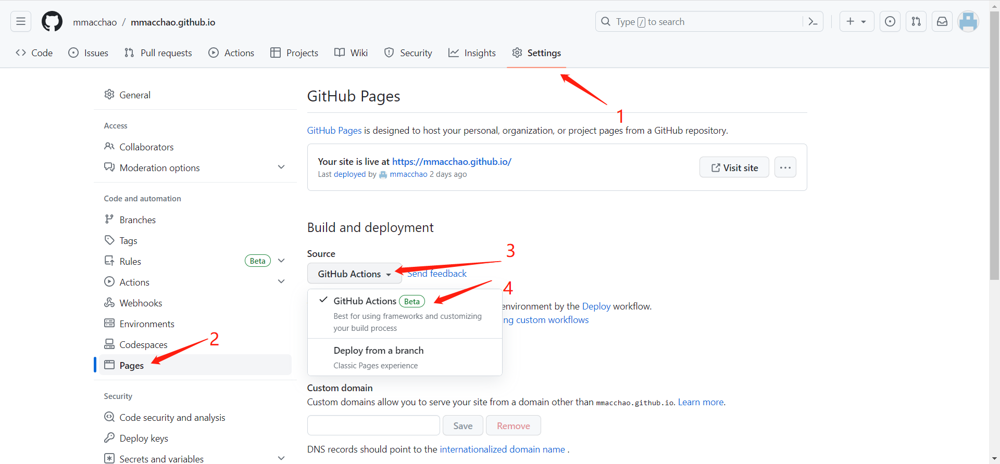
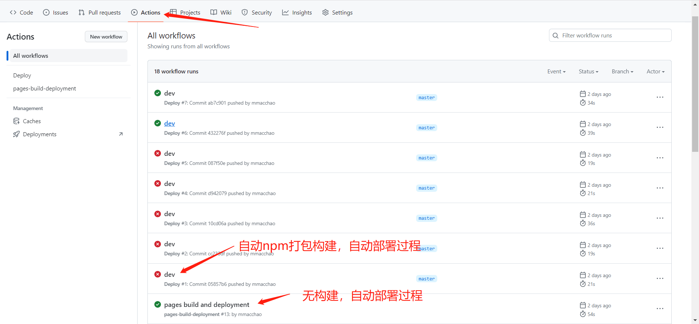

# 自动部署github
## 简介
github可以将你的github仓库部署到github pages站点，然后你就可以以“你的github用户名.github.io/你的仓库名称”的地址来访问部署后的站点

如果你的仓库名称就是“你的github用户名.github.io”，那访问地址就不需要加仓库名称了，直接就是“你的github用户名.github.io”
## 步骤
1. 新建一个仓库，仓库名称为 “你的github用户名.github.io”
2. 用vitepress创建项目，提交到新建的仓库中
3. [github设置](#github设置)
4. 提交代码后github会自动构建部署最新页面
5. 访问“你的github用户名.github.io”就会自动访问项目根目录的index.html了，当然你的仓库里面首先需要有一个index.html

## github设置
### 自动部署不需要构建的项目


### 自动构建，自动部署
1. 在仓库根目录创建目录.github/workflows，然后创建自动构建deploy.yml文件
```yaml
name: Deploy
on:
  workflow_dispatch: {}
  push:
    branches:
      - main
jobs:
  deploy:
    runs-on: ubuntu-latest
    permissions:
      pages: write
      id-token: write
    environment:
      name: github-pages
      url: ${{ steps.deployment.outputs.page_url }}
    steps:
      - uses: actions/checkout@v3
        with:
          fetch-depth: 0
      - uses: actions/setup-node@v3
        with:
          node-version: 16
          cache: npm
      - run: npm ci
      - name: Build
        run: npm run docs:build
      - uses: actions/configure-pages@v2
      - uses: actions/upload-pages-artifact@v1
        with:
          path: docs/.vitepress/dist
      - name: Deploy
        id: deployment
        uses: actions/deploy-pages@v1
```
::: tip
分支名称替换成你分支名称，假如你的分支名称是master, 就把上面的main替换成master
:::

2. 创建了yaml文件并上传后，再进行设置，github会自动识别你上传的配置文件



## 查看自动部署或者自动构建自动部署过程


## 需注意的点
- 如果你的仓库名称不是“你的github用户名.github.io”这个，那么vitepress里面的config.ts里面需要设置base为你的仓库名称
- deploy.yml文件路径确保是.github/workflows/deploy.yml
- 要上传package-lock.json文件
- deploy.yml里面的npm打包命令不用改成yarn或者pnpm，反正我改成yarn后线上构建失败

