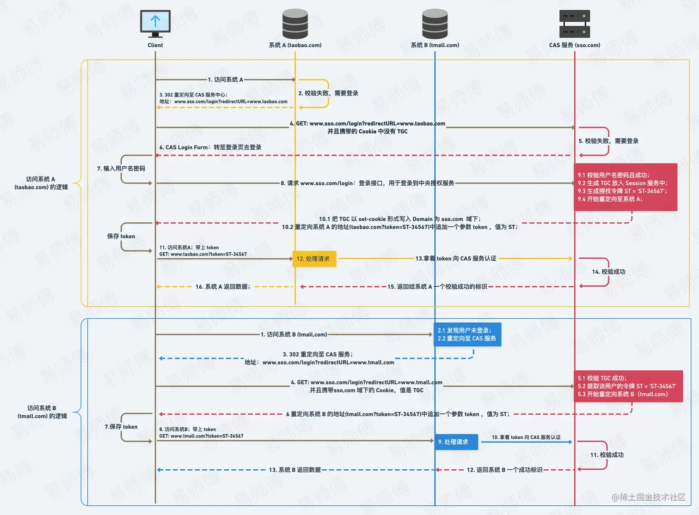

# 鉴权

参考：[一文教你搞定所有前端鉴权与后端鉴权方案，让你不再迷惘](https://juejin.cn/post/7129298214959710244?searchId=202505291620272D9817D3BC29EE65C6FB)

鉴权方案
- HTTP 基本鉴权
- Session Cookie鉴权
- Token鉴权
- JWT（JSON Web Token）鉴权
- 单点登录SSO（Single Sign On）

## HTTP 基本鉴权

服务器返回401和www-Authenticate头时，浏览器会自动弹出输入用户名和密码弹窗（前提是接口不能跨域，否则不会弹窗提示），
```
HTTP/1.1 401 Unauthorized
www-Authenticate: Basic realm="提示字符串"

// 输入用户名密码后，浏览器会把用户名密码base64编码，自动重发请求并带上头部
// 这个头部会一直存在，无法手动注销，直到关闭浏览器
// 如果手动设置了这个头部字段，那手动设置的优先级更高
Authorization: Basic Ksid2FuZzp3YW5n==
```

## session cookie鉴权

session是保存在服务器的数据，通过把sessionId存储在cookie里面，每次请求自动带上

存在的问题：移动端对cookie支持不好，分布式服务session不好处理，另外服务器保存session增加了开销

## Token鉴权

生成一个令牌，就是一段字符串，后续每个接口带上这个字符串即可

**一般 Token 的组成：**

uid (用户唯一的身份标识) + time (当前时间的时间戳) + sign (签名，Token 的前几位以哈希算法压缩成的一定长度的十六进制字符串)

## JWT（JSON Web Token）鉴权

JWT 由三部分组成： Header 头部、 Payload 负载 和 Signature 签名

它是一个很长的字符串，中间用点（.）分隔成三个部分。其中header和payload是base64编码，等效于明文

header
```js
 {
   "alg": "HS256", // hash算法
   "typ": "JWT"
 }
```

Payload
```js
{
   "sub": "1234567890",
   "name": "John Doe",
   "admin": true
}
// 官方字段，也可以自定义字段
// iss (issuer)：签发人
// exp (expiration time)：过期时间
// sub (subject)：主题
// aud (audience)：受众
// nbf (Not Before)：生效时间
// iat (Issued At)：签发时间
// jti (JWT ID)：编号

```

Signature 签名
```js
// 依据header，payload和header里面指定的hash算法签名
// 密钥（secret）。这个密钥只有服务器才知道，不能泄露给用户
HMACSHA256(
   base64UrlEncode(header) + "." +
   base64UrlEncode(payload),
   secret)
```

传递jwt
```js
// 一般放在Authorization字段里面，也可以任意其他方式传递
// Authorization的设计就是用于权限相关
Authorization: Bearer <token>
```

**jwt流程**


## SSO单点登录

- 同域下可以用Session-Cookie 认证
- 不同域可以用CAS（Central Authentication Service）中央授权服务

## cas认证

代码实现参考本仓库 examples -> 鉴权demo -> cas



疑问：为什么需要前端先获取ticket再给服务端去验证ticket，可以前端去验证ticket或者去掉验证步骤吗？

- 因为服务器验证ticket不只是验证，还需要获取用户信息以及对用户信息加密
- 那直接把用户信息给到前端，不需要再去验证ticket可以吗，前端信息一般拼在url后面，那就暴露的太明显了

## oauth2
oauth2一般用于给第三方访问服务器资源授权

## oauth2与cas的区别
两者都能实现SSO，但各自的关注重点不同，实现逻辑也有差异，现代系统中，CAS常与OAuth 2.0混合使用（如CAS 5.x支持OAuth），在统一认证基础上增加授权灵活性

1. CAS的应用场景
   - 解决企业内部单点登录（认证）
   - 资源在客户端，CAS服务端只提供一个认证功能
2. OAuth的应用场景
   - 互联网应用、第三方API集成、移动/微服务架构
   - 资源在服务端，授权第三方应用访问存在在服务器中的用户资源

