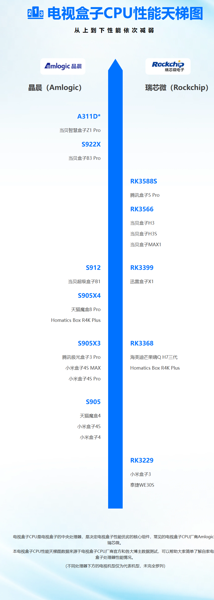
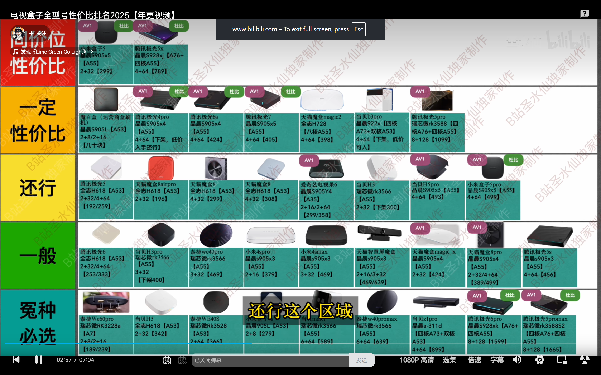
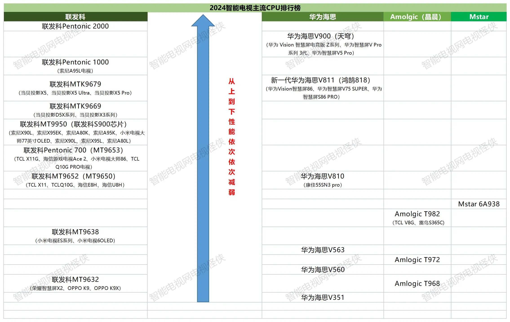

## 移动魔百盒刷机

手里有个废弃的魔百盒，老家没装IPTV，正好刷成三方系统安装TVBOX类似软件看直播

## 刷机教程

- 卡刷：利用盒子自己的系统升级原理，直接升级
- 线刷：利用soc厂家的刷机工具，盒子连接电脑重装系统

我的盒子型号是‘中兴B863AV3.2-M’，google搜索刷机教程后，先尝试的卡刷，但是不管如何尝试都加载不了u盘中的recovery.img，放弃。

**卡刷**

卡刷有三个文件：
- recovery.img // 这个是系统更新启用软件，先加载了这个，才能运行update.zip，否则原生的recovery是不认update.zip的
- update.zip // 更新包
- factory_update_param.aml // 一些刷机配置

**线刷**

我的盒子cpu是晶晨的S905L-3A，[刷机教程](https://www.znds.com/tv-1218801-1-1.html)

步骤：
1. 确认cpu型号，一般拆机可以看到，但是多数cpu上会有散热板，移除散热板才能看到
2. 找到对应型号的ROM [固件用的这个链接里面的](https://www.znds.com/forum.php?mod=viewthread&tid=1244436)
3. 安装刷机软件：一般是cpu公司提供的，比如晶晨的Amlogic_USB_Burning_Tool_v2.2.0
4. 双公头USB线
5. 打开刷机软件，载入ROM，短接（有些不需要，我刷的这个需要，两个触点很近，用的一个一字起子），盒子通电的同时，快速用双公头线连接盒子和电脑
6. 软件识别到，就可以断开开始刷机了，刷完关闭软件，盒子连接电视即可开始使用

## 刷机后安装直播软件

刷机后系统自带了小白文件管理器，电脑可以开启SMB共享文件夹（我的电视偏低端，电脑的smb要确保是开启的1.0协议），文件管理器可以像打开u盘一样打开共享文件夹。也可以用当贝市场远程安装apk

系统自带了一个视频播放软件，叫'看看电视'，里面的频道很全，包括全国各个省份的地方台，但是广告频道很多。我找的很多第三方直播源都没这个全。

但是网上搜不到这个软件，问了AI得到的回答：

> 这是一个牟利手段，里面内置了盗版团队获取的全国各地的iptv直播链接，再插入广告链接牟利

免费的，有些广告就忍了吧

## 盒子cpu型号
在这个过程中了解了常用盒子的cpu主要用的晶晨的、瑞芯微的，移动魔百盒用的cpu s905L系列还行，能支持4k60hz解码，我的这个盒子淘宝90就能买到

但是盒子整体还是用的ARM A53/A55架构，整体还是偏弱，目前最强的已经开始升级架构了

盒子cpu天梯图，整体还是比电视上的性能要差些的

**常用盒子推荐购买情况2025**

## 电视cpu

电视除了视频解码，还有视频增加芯片，像高端电视有些会自己做视频增强芯片。

像小米的入门电视基本也是用的入门cpu

电视cpu天梯图

## 视频质量

实测同一个app，装在盒子里和装在电视里，盒子里的明显感觉噪点更多，也不知道是什么问题。

