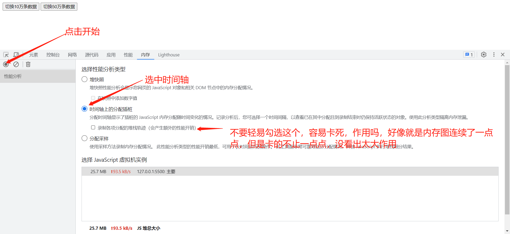
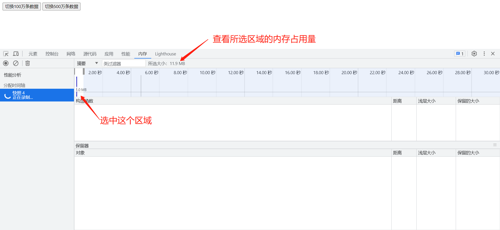
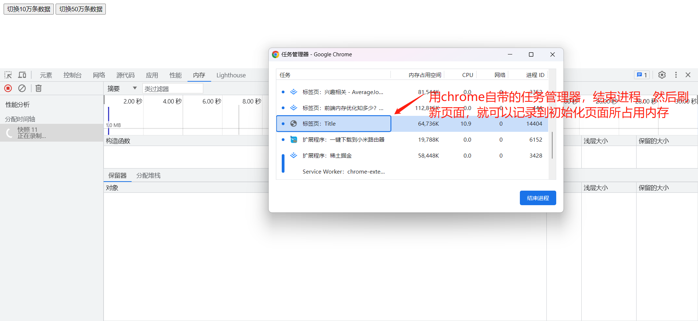
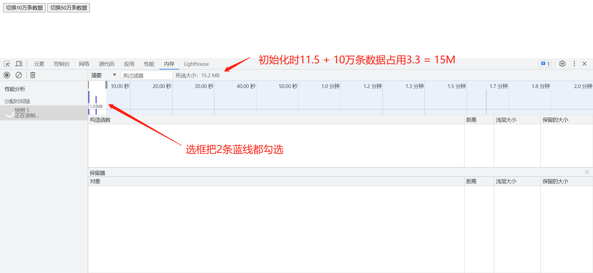
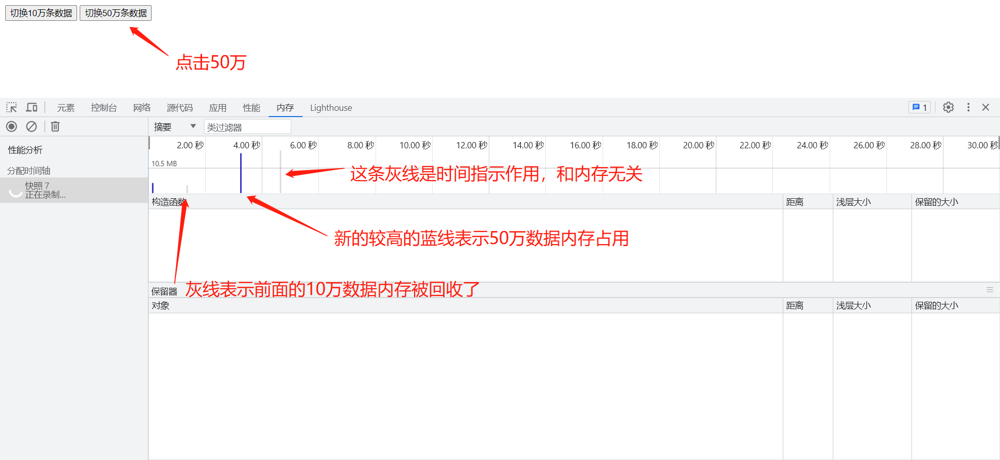
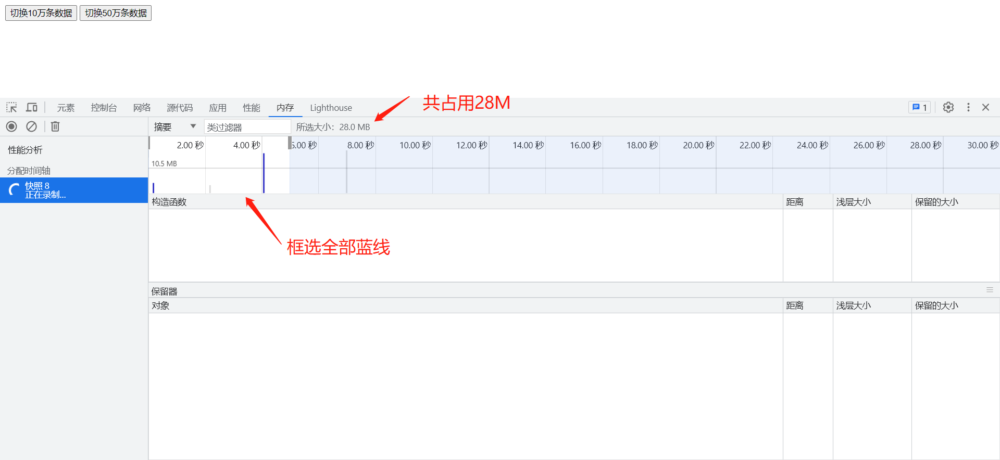
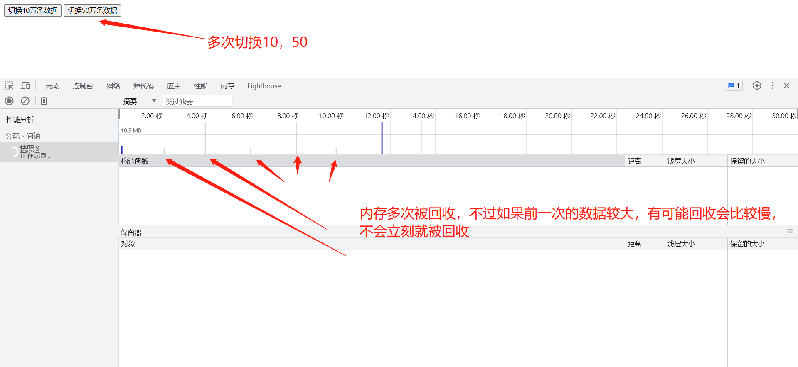
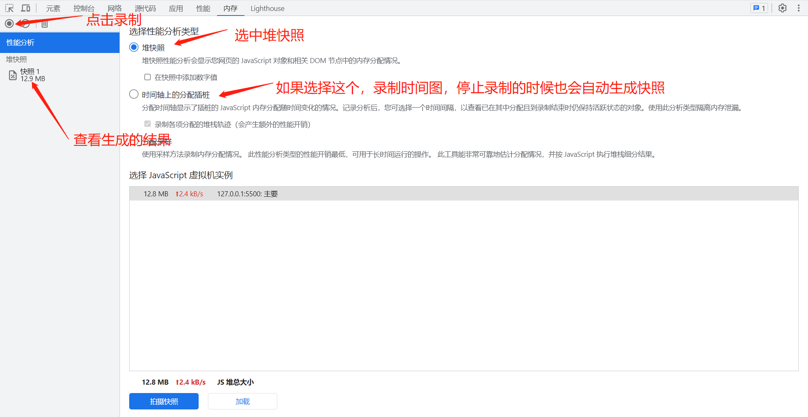
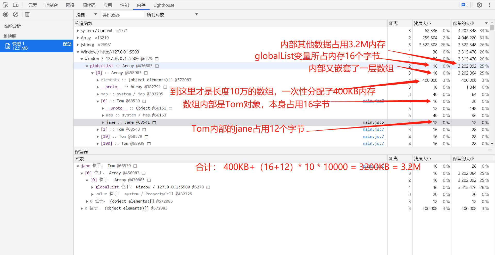
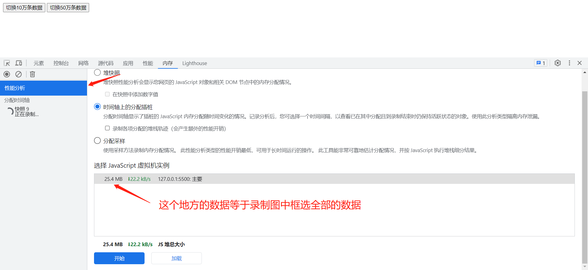

# 前端内存优化 - 四万条数据导致页面崩溃的问题

项目中有个页面，表格数据很多，用了handsontable来展示，这个表格通过虚拟滚动来呈现大数据，当数据来到4万条时，后端加载时间很长，
但耐心等等总会加载出来，但是等着等着，前端却爆了个内存溢出，页面崩溃！

既然知道了是内存溢出，首先了解下怎么看页面的内存占用情况

参考：[前端内存优化知多少？内存泄露只是冰山一角](https://juejin.cn/post/7197025946918502456)

## demo代码
```html
<!--index.html-->
<div>
  <button onclick="load(10 * 10000)">切换10万条数据</button>
  <button onclick="load(50 * 10000)">切换50万条数据</button>
</div>
<script src="./main.js"></script>
```

```js
// main.js
function load(num) {
  class Jane {}
  class Tom {
    constructor () { this.jane = new Jane();}
  }
  let list = Array(num).fill('').map(() => new Tom())
  window.globalList = [list]
}
```

## chrome控制台 - 内存选项卡使用说明
**打开控制台，切换到内存选项卡**


**一上来就根蓝线，这就是页面初始化占用的内存，不过一般你打开控制台是录制不到这个初始化内存占用的，看下一张图教你如何录制初始化内存占用**


**如何录制初始化内存占用**


**10万数据内存占用3.3M，加上初始化的11.5, 总的约等于15M**



**50万数据内存占用**



**灰色线表示内存回收**


**得到快照，然后分析具体变量的内存占用**


**计算10万数据的3.3M内存是哪些变量占用的**


**内存tab页中的虚拟机实例所占数据介绍**


### 刷新页面说明
多次刷新页面会导致占用内存不停的增加，按常理不是应该变回初始值吗，也许回收比较慢，但是等了很久依然内存占用依然没有降下去。所以要刷新页面重新录制内存占用，还是用前面说的那个方法，用自带管理器杀进程，再刷新页面

## 内存回收慢的问题
大内存数据不使用后存在回收缓慢的问题，导致多次切换大数据，内存使用量翻倍，旧的内存占用迟迟未回收

当你确定数据应该被回收却没有回收，尝试点击控制台 内存 -》 回收垃圾 按钮，如果是GC执行慢，那这一步强制GC应该可以回收，如果这一步都未回收，你就得检查代码了


## 项目4万数据，内存溢出分析
我的电脑比较强大，4万数据勉强加载了出来，打开内存tab页一看，内存占用2个多G，然后通过内存快照分析具体哪个变量占用的内存较大（2G内存用快照的话，页面直接崩溃，用的较小数据调试的），
因为项目使用的vue2，打开快照后基本看不懂哪个变量占用内存大，全是一些vue内部变量，且嵌套层数相当深，根本看不懂哪个变量内存占用大。遂放弃快照分析。

经过一通代码分析，得出的结论是，原始数据经过了多次深克隆，被保存了多份，导致内存爆满，至于为何多次深克隆？只能说写代码时我会管这么多吗。

解决方案：把深克隆的地方都去除了，再修修bug，内存占用变成了1.2G

后续优化：如果能不把数据变成vue2的响应式对象，会不会内存占用变的更小？对于有大数据的页面，原来不仅要考虑展示问题，还尼玛有内存问题，世界太难了。

