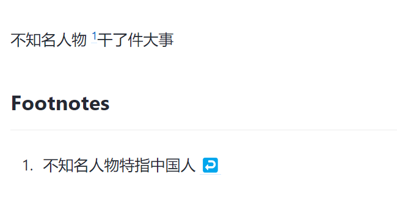
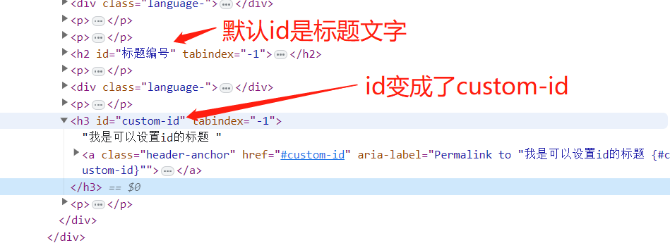

# markdown扩展语法
并非所有 Markdown 应用程序都支持这些元素，代码块一般都支持
## 表格
*input*
``` 
| 标题1 | 标题2 | 标题3 |
| ---  | --- | --- |
| 内容1 | 内容2 | 内容3 |
```
*output*
| 标题1 | 标题2 | 标题3 |
| ---  | --- | --- |
| 内容1 | 内容2 | 内容3 |

## 代码快
*input*
````
```js
console.log("hello world");
console.log("hi");
``` 
````
*output*
```js
console.log("hello world");
console.log("hi");
``` 

## 脚注
vitepress不支持脚注

*input*
```
不知名人物 [^1]干了件大事

[^1]:不知名人物特指中国人
``` 
*output*

掘金网站上的效果图


## 标题编号
*input*
``` 
### 我是可以设置id的标题 {#custom-id}
```
*output*
### 我是可以设置id的标题 {#custom-id}


## 定义列表
*input*
``` 
First Term
: This is the definition of the first term.

Second Term
: This is one definition of the second term.
: This is another definition of the second term.
```
*output*

> <dl>
>   <dt>First Term</dt>
>  <dd>This is the definition of the first term.</dd>
>  <dt>Second Term</dt>
>  <dd>This is one definition of the second term. </dd>
>  <dd>This is another definition of the second term.</dd>
> </dl>

## 删除线
*input*
``` 
~~The world is flat.~~
```
*output*

> ~~The world is flat.~~

## 任务列表
*input*
``` 
- [x] Write the press release
- [ ] Update the website
- [ ] Contact the media
```
*output*

> <div><input type="checkbox" checked>Write the press release</div>
> <div><input type="checkbox" >Update the website</div>
> <div><input type="checkbox" >Contact the media</div>
