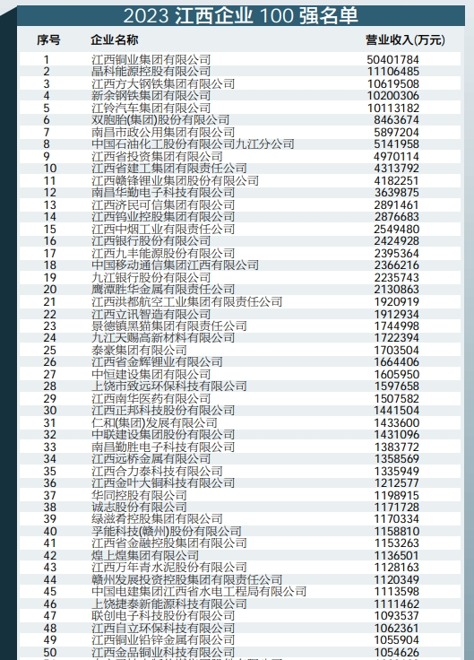

# 经济类

闲来无事，聊一聊江西省的100强企业

[江西2022年50强]()

## 方大钢铁集团

[捕猎海航，揭秘方大集团并购往事](https://mp.weixin.qq.com/s/WhkuVrTfITVdM-_sqisDKA)

[官网](http://www.jxfangda-steels.com/index/about/id/1.html)

- 民营企业
- 方大集团全资子公司
- 主体之控股的方大特钢为收购的国企南昌钢铁改名而来
- 总部位于南昌青山湖区
- 2022年方大钢铁集团营收超1000亿
- 主营钢铁加工业

## 新余钢铁
[新钢集团](https://www.xinsteel.com.cn/Investor/info.html)
- 央企一级子公司
- 2022年成为宝武集团的子公司，化身为央企
- 2022营收超1000亿
- 总部位于新余市
- 主营钢铁加工业

## 赣锋锂业

[20230408-公司浅析：赣锋锂业](https://mp.weixin.qq.com/s/nNFIMYfYbhYH3vL-fFkWCQ)

- 民营企业
- 主营锂矿开采、加工
- 2022营收400亿，不过利率极高，因为是直接采矿型
- 2022年利润200亿，营收和利润都是2022直接爆炸，因为电动车大爆发
- 总部位于新余市
- 竞争对手：天齐锂业

## 南昌华勤电子科技有限公司

## 江西省投资集团
[介绍](https://mp.weixin.qq.com/s/ZD6TZon1h9hUTqpHZZZ7-g)

省属国企，业务很杂。

## 济民可信

[解读“中成药”江西济民可信药业有限公司](https://mp.weixin.qq.com/s/umWJlSG2MBe-1mq-CGggPg)

民营企业集团，业务杂，代表性产品：中药

[官网](https://www.huaqin.com/about/company)

- 民营企业
- 属于总部位于上海的华勤技术股份有限公司的全资子公司，华勤技术已于2023年8月主板上市
- 主营OEM，即代加工服务
- 2022营收360亿，集团公司营收960亿
- 南昌研发中心位于南昌高新区天祥大道
- 竞争对手：立讯

## 50强企业类型

1. 江铜：铜矿，铜加工省属国企
2. 晶科能源：主营光伏组件生成的民营企业
3. 方大钢铁：主营钢铁加工的民企
4. 新余钢铁：主营钢铁加工的央企一级子公司
5. 江铃汽车集团：主营汽车生成的南昌市属国企
6. 双胞胎：主营饲料及生猪养殖的民企
7. 南昌市政公用集团：主营南昌市区内的供水、供气、污水处理、水气管网建设的市属国企
8. 中石油九江分公司：主营原油加工业务的央企子公司
9. 江西省投资集团：业务很杂，省属国企。
10. 江西建工：主营建筑施工的省属国企
11. 赣锋锂业：主营锂矿、锂加工的民企
12. 华勤电子：主营手机OEM的民企
13. 济民可信：主营中药及健康产业的民企
14. 江西钨业：主营钨矿及加工的省属国企
15. 江西中烟：主营金圣和庐山牌卷烟，是中烟公司的子公司，属于央企子公司，上交税金200亿，江西第一
16. 江西银行：主营放贷，由南昌商业银行改名而来，股东都是本地的国企和大私企，股权较分散，最大单一股东为省交通投资集团的15%,算国企
17. 江西九丰能源：主营天然气贸易的民企，总部在广东
18. 中国移动江西分公司：主营电信通信的央企子公司
19. 九江银行：地方银行，主营放贷
20. 鹰潭胜华金属：
21. 江西洪都航空：
22. 江西立讯制造：主营OEM的民企
23. 景德镇黑猫集团：
24. 九江天赐高新材料：
25. 泰豪集团：
26. 江西省金辉锂业
27. 中恒建设：主营建筑施工的民企
28. 上饶市致远环保：
29. 江西南华医药：
30. 江西正邦科技：曾经江西民营老大，如今快倒闭的养猪民企
31. 仁和集团：
32. 中联建设：
33. 南昌勤胜电子
34. 江西远桥金属
35. 江西合力泰科技：
36. 江西金叶大同科技：
37. 华同控股
38. 诚志股份
39. 绿滋肴集团：地产公司吧？
40. 赣州孚能科技：
41. 江西省金融控股：
42. 煌上煌集团：主营食品生产及加工的民企
43. 江西万年青水泥：
44. 赣州发展投资集团：
45. 中国电建江西水电工程局：
46. 上饶捷泰新能源科技：
47. 联创电子：
48. 江西自立环保科技：
49. 江西铜业铅锌金属：江铜已经上榜了，怎么手下的小弟还来参榜？
50. 江西金品铜业科技

